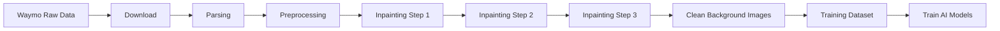

# Photo-real Project: Waymo Open Dataset Processing & Inpainting Pipeline

Waymo Open Dataset을 다운로드, 파싱, 전처리하고, 동적 객체 제거를 위한 고급 인페인팅 파이프라인을 제공하는 통합 툴킷입니다.

**주요 기능:**
- 📥 Waymo Open Dataset 자동 다운로드
- 📊 TFRecord 파싱 및 이미지/메타데이터 추출
- 🔄 다양한 포맷 변환 (COLMAP, NRE, 3DGS)
- 🎨 **3단계 인페인팅 파이프라인** (시계열 누적 → 기하학적 가이드 → AI 생성)
- 🤖 생성형 AI 모델 학습 데이터셋 빌더
- 🏗️ 3D 재구성 및 USD 변환

---

## 📁 프로젝트 구조

```
Photo-real_project/
├── download/                           # 데이터 다운로드
│   └── download_waymo.py              # Waymo 데이터 다운로드 스크립트
│
├── parsing/                            # 데이터 파싱/추출
│   ├── extract_waymo_data.py          # 이미지/마스크 추출 + JSON 메타데이터
│   ├── extract_waymo_data_minimal.py  # 경량 버전 (TF 의존성 최소화)
│   ├── waymo_utils.py                 # 공통 유틸리티 모듈
│   └── test_minimal_converter.py      # 변환 테스트 스크립트
│
├── preprocessing/                      # 데이터 전처리 및 변환
│   ├── waymo2colmap.py                # COLMAP 포맷 변환기
│   ├── waymo2nre.py                   # NRE 포맷 변환기 (권장)
│   ├── create_nre_pairs.py            # NRE 학습/검증 데이터셋 생성
│   ├── segmentation.py                # SegFormer 기반 동적 객체 세그멘테이션
│   └── run_preprocessing.py           # 전처리 파이프라인 실행
│
├── Inpainting/                         # 🆕 고급 인페인팅 파이프라인
│   ├── step1_temporal_accumulation.py # 시계열 정적 포인트 클라우드 누적
│   ├── step2_geometric_guide.py       # RANSAC 기반 기하학적 가이드 생성
│   ├── step3_final_inpainting.py      # Multi-view consistent AI 인페인팅
│   ├── training_dataset_builder.py    # LoRA/ControlNet 학습 데이터셋 빌더
│   └── README.md                      # 상세 인페인팅 가이드
│
├── dataset.py                          # 데이터셋 관리 모듈
├── reconstruction.py                   # 3D 재구성 (3DGS → USD 변환)
├── README.md                           # 📖 이 문서
├── README_WAYMO_CONVERSION.md         # 상세 변환 가이드
└── README_MINIMAL.md                  # Minimal 버전 가이드
```

---

## 🚀 빠른 시작 가이드

### 1. 환경 설정

#### 필수 요구사항
- Python 3.7+ (권장: 3.9 또는 3.10)
- CUDA 지원 GPU (인페인팅/학습용, 선택)
- Waymo Open Dataset 계정 (다운로드용)

#### 기본 패키지 설치

```bash
# 저장소 클론
git clone https://github.com/DaejunKang/Spatial-AI.git
cd Spatial-AI/Spatial_AI_Project/Photo-real_project

# 기본 의존성 설치
pip install numpy opencv-python tqdm

# Waymo Open Dataset 설치
pip install waymo-open-dataset-tf-2-11-0

# 인페인팅 파이프라인용 패키지
pip install open3d scikit-learn

# (선택) 생성형 AI 모델
pip install torch torchvision transformers diffusers accelerate

# (선택) 3DGS 재구성
pip install diff-gaussian-rasterization simple-knn
```

---

## 📖 전체 워크플로우



---

## 📥 Step 1: 데이터 다운로드

Waymo Open Dataset을 Google Cloud Storage에서 다운로드합니다.

```bash
# Google Cloud SDK 인증 (처음 1회만)
gcloud auth login

# 샘플 세그먼트 1개 다운로드 (테스트용)
python download/download_waymo.py ./data/waymo/raw --split training --limit 1

# 전체 학습 데이터 다운로드
python download/download_waymo.py ./data/waymo/raw --split training
```

**출력:**
```
./data/waymo/raw/
└── segment-xxxxxx.tfrecord
```

**상세 가이드:** [README_WAYMO_CONVERSION.md](README_WAYMO_CONVERSION.md)

---

## 📊 Step 2: 데이터 파싱

TFRecord 파일에서 이미지, 카메라 파라미터, 동적 객체 정보를 추출합니다.

### Option A: Minimal 버전 (권장, TensorFlow 의존성 최소화)

```bash
python parsing/extract_waymo_data_minimal.py \
    ./data/waymo/raw \
    ./data/waymo/extracted
```

### Option B: 표준 버전 (TensorFlow 필요)

```bash
python parsing/extract_waymo_data.py \
    ./data/waymo/raw \
    ./data/waymo/extracted
```

**출력:**
```
./data/waymo/extracted/
├── images/FRONT/*.png          # 카메라별 이미지
├── masks/FRONT/*.png           # 동적 객체 마스크
├── poses/vehicle_poses.json   # Vehicle pose
└── calibration/intrinsics_extrinsics.json  # 카메라 calibration
```

**상세 가이드:** [README_MINIMAL.md](README_MINIMAL.md)

---

## 🔄 Step 3: 데이터 전처리 및 변환

다양한 3D 재구성 파이프라인을 위한 포맷 변환을 수행합니다.

### 3.1 NRE (Neural Rendering Engine) 포맷 변환 (권장)

3D Gaussian Splatting 및 Neural Rendering에 최적화된 포맷입니다.

```bash
python preprocessing/waymo2nre.py \
    ./data/waymo/raw \
    ./data/waymo/nre_format \
    --prefix seq0_
```

**출력:**
```
./data/waymo/nre_format/
├── images/                    # JPEG 이미지
│   ├── seq0_000001_FRONT.jpg
│   └── ...
├── poses/                     # 프레임별 지오메트리 정보
│   ├── seq0_000001.json
│   └── ...
└── objects/                   # 프레임별 동적 객체 정보
    ├── seq0_000001.json
    └── ...
```

**Pose JSON 구조:**
```json
{
    "frame_idx": 1,
    "timestamp": 1234567890.123456,
    "ego_velocity": {
        "linear": [1.5, 0.0, 0.0],
        "angular": [0.0, 0.0, 0.05]
    },
    "cameras": {
        "FRONT": {
            "img_path": "images/seq0_000001_FRONT.jpg",
            "width": 1920,
            "height": 1280,
            "intrinsics": [fx, fy, cx, cy, k1, k2, p1, p2, k3],
            "pose": [...]  // 4x4 matrix (flatten)
        }
    }
}
```

### 3.2 NRE 학습/검증 데이터셋 생성

3DGS 학습을 위한 train/val 분할 데이터셋을 생성합니다.

```bash
python preprocessing/create_nre_pairs.py \
    ./data/waymo/nre_format \
    --output_dir ./data/waymo/nre_format \
    --val_interval 10
```

**출력:**
```
./data/waymo/nre_format/
├── train.json                 # 학습 데이터 (90%)
└── val.json                   # 검증 데이터 (10%)
```

### 3.3 COLMAP 포맷 변환

COLMAP SfM 파이프라인과 호환되는 포맷으로 변환합니다.

```bash
python preprocessing/waymo2colmap.py \
    ./data/waymo/extracted \
    ./data/waymo/colmap_format
```

**출력:**
```
./data/waymo/colmap_format/
├── cameras.txt                # 카메라 내부 파라미터
├── images.txt                 # 이미지 포즈
└── points3D.txt              # 빈 파일 (SfM 전용)
```

### 3.4 동적 객체 세그멘테이션 (선택)

SegFormer를 사용하여 동적 객체 마스크를 생성합니다.

```bash
python preprocessing/run_preprocessing.py \
    ./data/waymo/nre_format \
    --use_segformer \
    --device cuda
```

---

## 🎨 Step 4: 고급 인페인팅 파이프라인

동적 객체를 제거하고 정적 배경으로 채우는 3단계 인페인팅 파이프라인입니다.

### 4.1 Step 1: 시계열 누적 (Temporal Accumulation)

여러 프레임의 정적 영역을 3D 포인트 클라우드로 누적하여 다시 투영합니다.

```bash
cd Inpainting

python step1_temporal_accumulation.py \
    ../data/waymo/nre_format \
    --voxel_size 0.05 \
    --sample_interval 5
```

**알고리즘:**
1. Forward Pass: 정적 영역의 3D 포인트를 전역 좌표계로 누적
2. Voxel downsampling으로 중복 제거
3. Backward Pass: 전역 포인트를 각 프레임에 재투영
4. Z-buffering으로 가시성 처리

**출력:**
```
./data/waymo/nre_format/
└── step1_warped/              # 시계열 누적 결과
    ├── seq0_000001_FRONT.png
    └── ...
```

### 4.2 Step 2: 기하학적 가이드 생성 (Geometric Guide)

RANSAC 기반 평면 피팅으로 남은 구멍의 depth를 추정합니다.

```bash
python step2_geometric_guide.py \
    ../data/waymo/nre_format \
    --ground_ratio 0.6
```

**알고리즘:**
1. Step 1 결과에서 구멍 감지 (검은색 픽셀)
2. 이미지 하단 영역에서 바닥 평면 샘플링
3. RANSAC으로 평면 방정식 피팅: Z = aX + bY + c
4. 구멍 영역의 depth 예측

**출력:**
```
./data/waymo/nre_format/
├── step2_depth_guide/         # 기하학적으로 채워진 depth
│   ├── seq0_000001_FRONT.png
│   └── ...
└── step2_hole_masks/          # 구멍 영역 마스크
    ├── seq0_000001_FRONT.png
    └── ...
```

### 4.3 Step 3: 최종 인페인팅 (Final Inpainting)

Step 1과 Step 2의 결과를 결합하여 생성형 AI 기반 최종 인페인팅을 수행합니다.

```bash
# OpenCV 기반 (빠르고 가벼움)
python step3_final_inpainting.py ../data/waymo/nre_format

# Stable Diffusion 기반 (더 자연스러운 결과)
python step3_final_inpainting.py ../data/waymo/nre_format --use_ai
```

**알고리즘:**
1. 원본 이미지 + Step 1 warped 이미지 융합
2. Step 2 구멍 마스크로 인페인팅 영역 결정
3. Stable Diffusion으로 생성 (또는 OpenCV inpainting)
4. 텍스처 노이즈 추가로 자연스러운 결과

**출력:**
```
./data/waymo/nre_format/
└── step3_final_inpainted/     # 최종 완성 이미지
    ├── seq0_000001_FRONT.png
    └── ...
```

**상세 가이드:** [Inpainting/README.md](Inpainting/README.md)

---

## 🤖 Step 5: 생성형 AI 학습 데이터셋 생성 (선택)

인페인팅 결과를 활용하여 LoRA 및 ControlNet 학습용 데이터셋을 생성합니다.

```bash
cd Inpainting

# 모든 데이터셋 생성
python training_dataset_builder.py \
    ../data/waymo/nre_format \
    --mode all \
    --max_samples 1000

# LoRA 데이터셋만
python training_dataset_builder.py \
    ../data/waymo/nre_format \
    --mode lora \
    --lora_trigger "WaymoStyle autonomous driving scene"

# ControlNet Canny 데이터셋만
python training_dataset_builder.py \
    ../data/waymo/nre_format \
    --mode controlnet_canny \
    --canny_low 100 \
    --canny_high 200

# ControlNet Depth 데이터셋만
python training_dataset_builder.py \
    ../data/waymo/nre_format \
    --mode controlnet_depth
```

**출력:**
```
./data/waymo/nre_format/gen_ai_train/
├── lora_dataset/
│   ├── 000000.jpg             # 깨끗한 배경 이미지
│   ├── 000001.jpg
│   └── metadata.jsonl         # HuggingFace format
│
└── controlnet_dataset/
    ├── train/
    │   ├── 000000.jpg         # Target 이미지
    │   └── ...
    ├── conditioning_images/
    │   ├── 000000_cond.png    # Canny edge or Depth
    │   └── ...
    └── metadata.jsonl         # HuggingFace format
```

**metadata.jsonl 예시:**

LoRA:
```json
{"file_name": "000000.jpg", "text": "WaymoStyle road", "original_file": "seq0_000001_FRONT.jpg"}
```

ControlNet:
```json
{"text": "high quality road scene", "image": "train/000000.jpg", "conditioning_image": "conditioning_images/000000_cond.png", "original_file": "seq0_000001_FRONT.jpg"}
```

### 생성형 AI 모델 학습

HuggingFace Diffusers 학습 스크립트와 호환됩니다.

**LoRA 학습:**
```bash
python train_text_to_image_lora.py \
    --pretrained_model_name_or_path="runwayml/stable-diffusion-v1-5" \
    --train_data_dir="gen_ai_train/lora_dataset" \
    --caption_column="text" \
    --resolution=512 \
    --train_batch_size=4 \
    --num_train_epochs=100 \
    --learning_rate=1e-4 \
    --output_dir="./output/waymo_lora"
```

**ControlNet 학습:**
```bash
python train_controlnet.py \
    --pretrained_model_name_or_path="runwayml/stable-diffusion-v1-5" \
    --train_data_dir="gen_ai_train/controlnet_dataset" \
    --conditioning_image_column="conditioning_image" \
    --image_column="image" \
    --caption_column="text" \
    --resolution=512 \
    --train_batch_size=4 \
    --num_train_epochs=100 \
    --learning_rate=1e-5 \
    --output_dir="./output/waymo_controlnet"
```

---

## 🏗️ Step 6: 3D 재구성 (선택)

3D Gaussian Splatting으로 재구성하고 USD 포맷으로 변환합니다.

```bash
# 3DGS 학습 (별도 저장소 필요)
# https://github.com/graphdeco-inria/gaussian-splatting

# 재구성 결과를 USD로 변환
python reconstruction.py \
    ./output/3dgs/point_cloud.ply \
    ./output/scene.usd
```

---

## 📊 포맷 비교

| 기능 | NRE | COLMAP | Extract |
|------|-----|--------|---------|
| TensorFlow 불필요 | ✅ | ✅ | ❌ |
| 동적 객체 라벨 | ✅ | ❌ | ❌ |
| Rolling Shutter | ✅ | ❌ | ❌ |
| 속도 정보 | ✅ | ❌ | ❌ |
| 마스크 생성 | ❌ | ❌ | ✅ |
| SfM 호환 | ❌ | ✅ | ❌ |
| 3DGS 호환 | ✅ | ✅ | ✅ |

**권장 포맷:** `waymo2nre.py` (NRE)

---

## 🛠️ 고급 설정

### Depth 정보가 없는 경우

Inpainting 파이프라인에서 depth 맵이 없으면 pseudo depth를 자동 생성합니다.
더 나은 결과를 위해 monocular depth estimation을 사용할 수 있습니다:

```python
# TODO: Monocular depth estimation 통합
from depth_anything import DepthEstimator
depth_estimator = DepthEstimator()
depth = depth_estimator.predict(image)
```

### Stable Diffusion Inpainting 통합

`Inpainting/step3_final_inpainting.py`에서 생성형 AI를 사용하려면:

```python
# _initialize_generative_model() 메소드 수정
from diffusers import StableDiffusionInpaintPipeline
import torch

model_id = "stabilityai/stable-diffusion-2-inpainting"
self.pipe = StableDiffusionInpaintPipeline.from_pretrained(
    model_id,
    torch_dtype=torch.float16
)
self.pipe = self.pipe.to("cuda")
```

실행:
```bash
pip install diffusers transformers accelerate
python step3_final_inpainting.py /data --use_ai
```

### 메모리 최적화

대용량 시퀀스 처리 시:

1. **Step 1**: `--sample_interval` 증가, `--voxel_size` 증가
2. **Step 2**: `--ground_ratio` 조정
3. **Dataset Builder**: `--max_samples` 제한

```bash
# 예시: 메모리 절약 모드
python step1_temporal_accumulation.py /data \
    --sample_interval 10 \
    --voxel_size 0.1

python training_dataset_builder.py /data \
    --mode all \
    --max_samples 500
```

---

## 🐛 문제 해결

### TensorFlow 관련 오류

```bash
# TensorFlow 2.11.0 설치 (Python 3.7-3.10)
pip install tensorflow==2.11.0

# 또는 Minimal Mode 사용
python parsing/extract_waymo_data_minimal.py ...
```

### Waymo Dataset 패키지 오류

```bash
# 호환되는 버전 설치
pip uninstall waymo-open-dataset-tf-2-11-0
pip install waymo-open-dataset-tf-2-11-0==1.5.2
```

### "No points accumulated" 경고 (Inpainting Step 1)

**원인:**
- Depth 파일이 없거나 경로가 잘못됨
- Mask가 모두 0 (동적)으로 되어 있음
- Pose 파일 형식이 다름

**해결:**
1. Depth 파일 경로 확인: `data_root/depths/`
2. Mask 확인: 255 값이 있는지 확인
3. Pose JSON 구조 확인

### "Insufficient valid depth points" 경고 (Inpainting Step 2)

**해결:**
1. `--ground_ratio` 값을 조정 (예: 0.5로 낮춤)
2. Step 1의 voxel_size를 줄여 더 조밀한 포인트 클라우드 생성
3. `--no_lidar` 옵션으로 pseudo depth 사용

### Open3D 오류

```bash
# Open3D 설치 또는 업그레이드
pip install --upgrade open3d

# CUDA out of memory 시
export OPEN3D_CPU_RENDERING=1
```

### 메모리 부족

- 한 번에 하나의 세그먼트만 처리
- 이미지 품질 낮추기 (JPEG quality 조정)
- `--sample_interval` 증가

---

## 📚 상세 문서

- **[README_WAYMO_CONVERSION.md](README_WAYMO_CONVERSION.md)**: 데이터 변환 상세 가이드
- **[README_MINIMAL.md](README_MINIMAL.md)**: Minimal 버전 가이드
- **[Inpainting/README.md](Inpainting/README.md)**: 인페인팅 파이프라인 상세 가이드

---

## 🔗 참고 자료

- [Waymo Open Dataset](https://waymo.com/open/)
- [COLMAP](https://colmap.github.io/)
- [3D Gaussian Splatting](https://github.com/graphdeco-inria/gaussian-splatting)
- [HuggingFace Diffusers](https://github.com/huggingface/diffusers)
- [OpenCV Documentation](https://docs.opencv.org/)

---

## 📝 라이센스

이 코드는 Waymo Open Dataset License를 따릅니다.
원본 데이터 사용 시 [Waymo Terms of Use](https://waymo.com/open/terms/)를 준수해야 합니다.

---

## 🙏 기여

이슈 및 Pull Request를 환영합니다!

저장소: [https://github.com/DaejunKang/Spatial-AI](https://github.com/DaejunKang/Spatial-AI)

---

## 📧 문의

프로젝트 관련 문의: GitHub Issues를 통해 연락 주세요.
